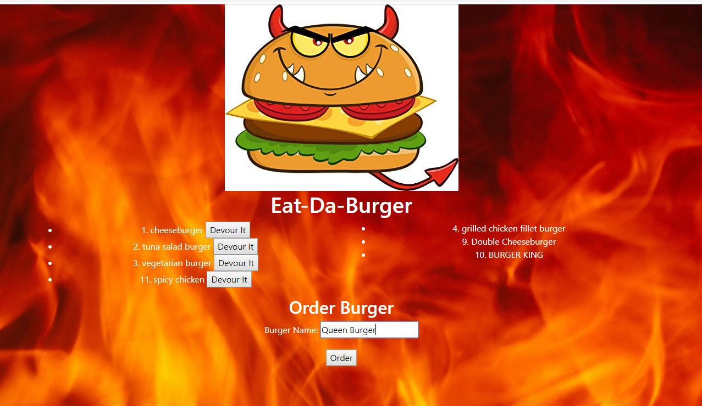

# BURGER - Online Burger Ordering
## Introduction
Web application to help customers order various types of burgers and mark them as consumed/devoured.

## Prerequisites
* MySql database  - running on localhost port 3306
* Node.js - local installation

## Initial Setup
1. Place you MySql root password to the following file: .env. File contents should look like:
```
PASSWORD=my_super_secure_password_12345
```
2. Run the following SQL script in MySql: db/schema.sql
3. Run the following SQL script in MySql: db/seeds.sql
4. Open bash/terminal and run the following command:
```
npm install
```

## Start The Server
Run the following command in bash/terminal:
```
node server.js
```

## Order Da Burger Page
Navigate to http://localhost:[port] for the home page.

You can perform two of the following actions:
* Order a burger
* Devour an ordered burger



### View Burgers
Two lists will appear on the main page:
* Ordered, but not yes devoured burgers will show up on the left side.
* Devoured burgers will show up on the right.

### Order a Burger
Fill out the `Burger Name` textx field and click `Order`. Order should soon show up in the left list above.

### Devour a Burger
Click the `Devour It` button next to the burger and the burger will be moved to the right list of devoured burgers.
